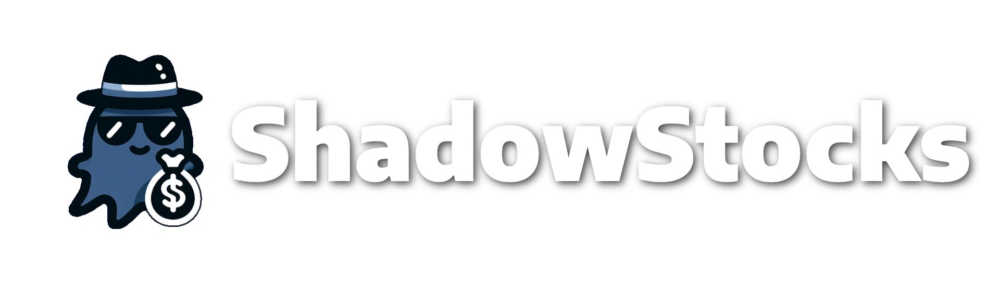

<div align="center">
  
  <h3 align="center">The Most Realistic Discord Economy Bot</h3>
  <h4 align="center">Made with <a href="https://discordpy.readthedocs.io/en/stable/">Discord.py</a> </h4>

  <hr>

  [](https://www.python.org/ "Python")

  [](https://www.python.org/)
  
 
  
  [](#)
  [](#)
  
  [](#)
  [](#)

  [](https://github.com/Hartley0426/ShadowStocks/releases/)
  <a href="https://discord.com/oauth2/authorize?client_id=1305645434349424640&permissions=1689935212444784&integration_type=0&scope=bot"> </a>
</div>


# Table of Contents
Found here will be all links you will need.

+ [About Us](#about-us)
+ [Bot Features](#special-features)
  + [Profiles](#profile)
  + [Levels](#levels)
  + [Time Scale](#time-scale)
  + [Full Time Jobs](#full-time-jobs)
  + [Education](#education)
  + [Real Estate & Property](#real-estate-and-property)
  + [Attributes](#attributes)
  + [Businesses](#businesses)
  + [Store & Market](#store-and-marketplace)
+ [Installation](#installation)


# About Us
Discord, a popular platform for communities to gather and communicate, has seen a significant increase in the development of bots to enhance user engagement. Among these, economy bots are particularly notable for their ability to simulate real-world economic systems and provide users with entertaining yet educational experiences. We distinguish ourselves through several key features:

**Complex Economic Simulation:**

- The bot emulates various economic activities such as trading, investing, and property management. It provides users with opportunities to earn virtual currency through activities that mirror real-world economic decisions.

**User Engagement and Interaction:**

- By incorporating dynamic and interactive commands, users can engage in activities like running virtual businesses, participating in auctions, and even creating unions or alliances with other users to enhance their economic influence.

**Community Integration:**

- The bot seamlessly integrates with other server activities, supporting events and goals that align with the community's interests. This fosters a collaborative environment where economic achievements contribute to overall community success.

By effectively simulating an intricate economic environment while providing entertainment, education, and engagement, this Discord economy bot stands out as the epitome of realism and interactivity. It serves as a valuable tool for any server

# Special Features

## Profile
The majority of information within ShadowStocks is centralized in a user profile, which serves as the core of your gameplay experience. This profile is fully customizable, allowing users the flexibility to create or delete it as needed. Acting as the foundation of personal progress, the profile organizes and tracks critical data, enabling users to efficiently manage their levels, achievements, inventory, and other gameplay elements within the ShadowStocks ecosystem.

## Levels
Profiles in ShadowStocks include difficulty levels to cater to various user preferences and skills. These levels allow users to customize their gameplay experience, ranging from relaxed and beginner-friendly settings to intense challenges for seasoned players. Adjusting the level modifies factors such as complexity, resource availability, and risk, tailoring the experience to the user's comfort. This ensures that players of all experience levels can enjoy ShadowStocks while feeling appropriately challenged.

## Time Scale
ShadowStocks operates on a distinct time scale designed to simulate real-world financial and economic dynamics. Each action in the bot follows a consistent format, ensuring uniformity and easy understanding for users. The time scale bridges the gap between real-time interactions and in-game events, creating a seamless flow of activities. This format ensures players can predict outcomes and strategize effectively while immersing themselves in the ShadowStocks experience.

1 Minute = `1 Second`
1 Hour = `1 Minute`
1 Day = `24 Minutes`
1 Month = `12 Hours`
1 Year = `6 Days`

## Full-Time Jobs
Unlike many economy bots that focus on passive income or simple tasks, ShadowStocks introduces full-time jobs requiring active participation. These jobs encourage users to pursue education and develop new skills, mimicking real-world career growth. Players must balance their time and resources to achieve qualifications, making the progression feel rewarding. This system adds depth to the gameplay, providing a sense of accomplishment as users climb the career ladder.

+ **Pay:**
`The pay for these jobs ranges from $5/Hour to $400/Hour, depending on the role.`

## Education
As previously mentioned, ShadowStocks integrates a structured education system designed to enhance user progression by requiring them to attend college to qualify for specialized jobs. This system not only serves as a gatekeeper for advanced roles but also emphasizes the importance of acquiring knowledge and skill development as a pivotal part of career advancement. By completing education programs, users unlock access to higher-paying positions, enabling them to achieve greater financial success.

## Real Estate and Property
ShadowStocks incorporates a comprehensive real estate and property system that allows users to generate returns based on their investments. This system provides a steady, passive income stream, rewarding users on a monthly basis after they purchase property.

+ **Property:**
`Property comprises houses you can own; however, these do not generate additional income. They are items you retain.`

+ **Real Estate:**
`Real estate includes houses and buildings that enable users to collect rent as a source of recurring income.`

## Attributes
ShadowStocks emphasizes a variety of attributes that users need to focus on and enhance through consistent effort to qualify for specific job opportunities. These attributes serve as critical benchmarks for eligibility, ensuring that users develop the necessary skills, knowledge, and proficiency required for higher-level roles. 

## Businesses
ShadowStocks empowers users to establish and manage their own businesses, offering a unique entrepreneurial experience. Players can create, grow, and customize their businesses, making decisions that influence profitability and sustainability. Managing a business involves handling various challenges like market demand, competition, and resource allocation. This feature fosters creativity and strategic thinking, giving users a dynamic and engaging gameplay element.

## Store and Marketplace
ShadowStocks includes both a store and a marketplace to cater to different user needs and preferences. The store offers standard items and resources at fixed prices, providing a reliable option for players. The marketplace, on the other hand, operates as a dynamic player-to-player trading system, allowing users to buy and sell items based on supply and demand. This dual system ensures a balanced economy while encouraging interaction and collaboration among players.

+ **Store:**
`The store is integrated with your profile, allowing you to purchase general items such as vehicles and more.`

+ **Marketplace:**
`The marketplace is linked to your account and synced with the guild, providing moderators with the ability to add exclusive items for purchase (e.g., Office Keys, VIP items, etc.).`

# Development Documentation

## Coding Conventions

- Folder & File name should be in `flatcase`

- Non-const variables should be in `snake_case`

- Profile attributes should be in `flatcase`

- Const variables should be in `MACRO_CASE`

- Class names should be in `PascalCase`

- Any lists or directories should be in `camelCase`

- Color Hexes in `constants.py` should be in `PascalCase`

- Function/Def names should be in `snake_case` and describe the use

## Directory Structure

```
┌ Main Directory
│
├ assets/ # Stores any assets
│  ├ itemimages/ # Stores images for items
│  └ propertyimages/ # Store images for properties
│
├ business_utils/ # Contains any utilites for businesses
│  └ businesses.py # Sets up classes for businesses
│
├ cogs/ # Stores all commands
│  ├ apply.py # Application commands
│  ├ attributetraining.py # Trains for your attributes
│  ├ bank.py # Balances, and transfers
│  ├ beg.py # Begging
│  ├ blackjack.py # Blackjack system
│  ├ business.py # The commands for businesses
│  ├ config.py # a configuration setup
│  ├ crime.py # Crime
│  ├ education.py # College
│  ├ fulltimejob.py # Collection for jobs
│  ├ inventory.py # Inventory
│  ├ market.py # Buying and view your assets
│  ├ parttimejobs.py # Work commands
│  ├ profileadmin.py # Creation, deletion, modication of profiles
│  ├ property.py # Property system
│  ├ realestate.py # Realestate system
│  ├ rob.py # Robbing people
│  ├ roulette.py # Roulette system
│  ├ slots.py # Slots
│  ├ smallgambling.py # Coinflips
│  └ store.py # Buy items
│
├ itemsutilites/
│  └ items.py # Framework for items
│
├ jobutilities/
│  ├ attributes.py # Attribute framework
│  ├ educationutils.py # Education framework
│  └ jobs.py # Jobs framwork
│
├ json/
│  ├ assets.json # Stores user assets
│  ├ assetsforpurchase.json # Stores guild data for assets that can be bought
│  └ settings.json # Stores setting values
│
├ realestate_utils/
│  ├ properties.py # Property framework
│  └ realestateutils.py # Realestate framework
│
├ utilities/
│  ├ embeds.py # Stores copy and paste embeds
│  ├ logs.py # Logs framework
│  ├ outcomes.py # Stores outcomes for certain commands
│  └ utils.py # Utility functions
│
├ main.py
├ .gitattributes
├ .gitignore
├ LICENSE
├ README.md
└ constants.py
```

# Installation
Installation of ShadowStocks is quite easy. 

## Steps

1. Navigate to this [link](https://discord.com/oauth2/authorize?client_id=1305645434349424640&permissions=1689935212444784&integration_type=0&scope=bot)
2. Once you get to that link, you should see a screen like the one below. If so, set the server you'd like to add the bot to, and then click continue. *(Both highlighted in red)*

    
    
3. Once the bot is added to your server. Ensure you have the administrator permission *(If you don't know if you do you probably don't)*.
4. Lastly, all you have to do is run /config to set the `log channel ID` and the `moderator ID`

# Authors

**Head Developer:** `@hartley0426` | <a href="https://github.com/hartley0426"> </a> 
